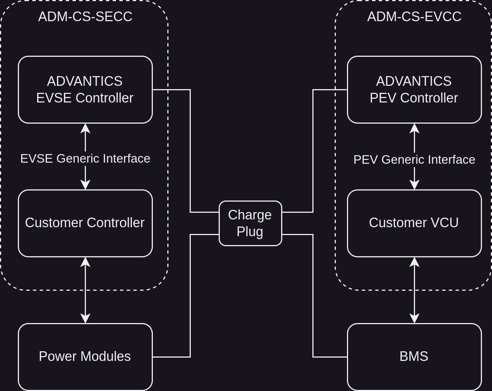
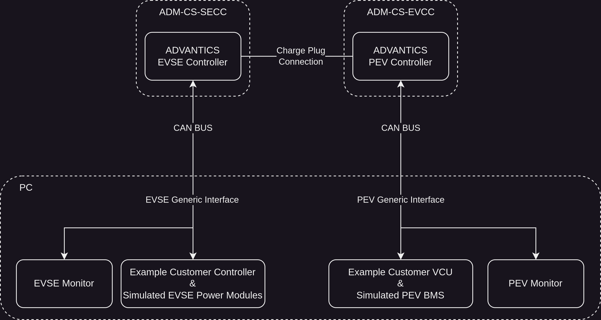
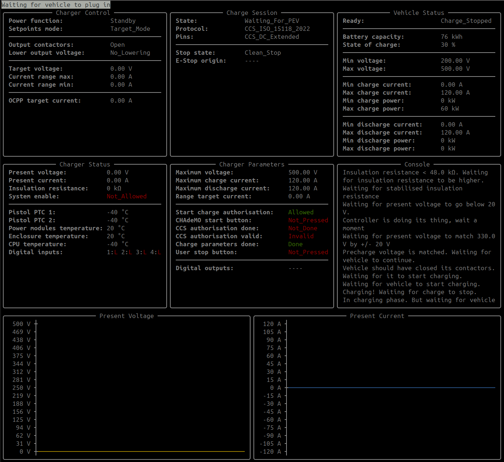
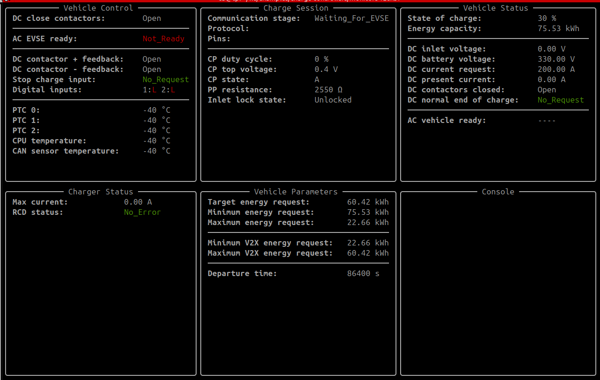
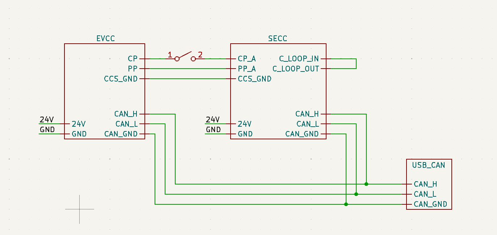
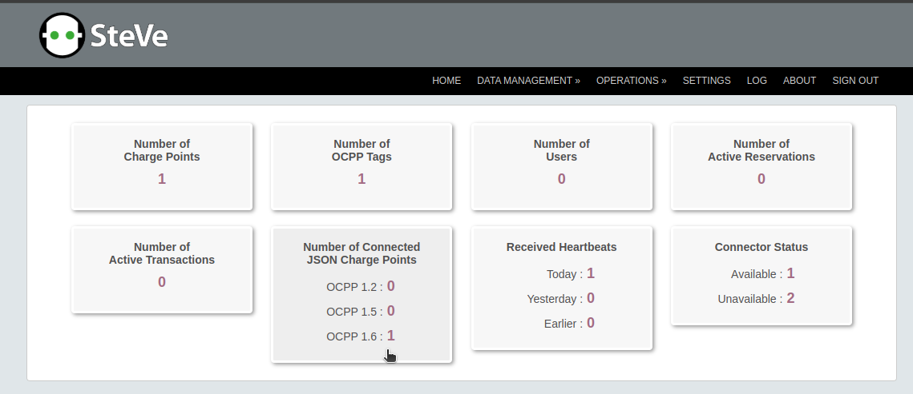
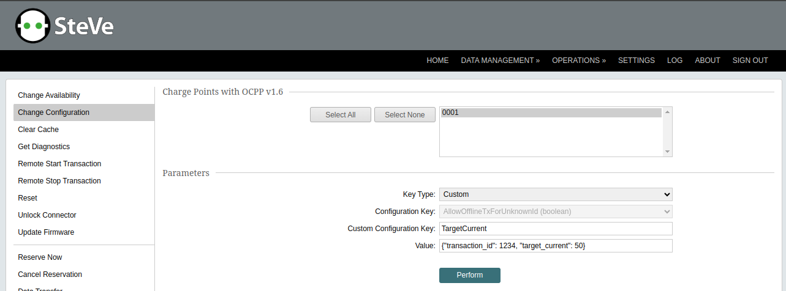

<!-- TOC -->
  * [Overview](#overview)
  * [Typical Real System](#typical-real-system)
  * [The Simulated System](#the-simulated-system)
  * [Hardware Setup](#hardware-setup)
    * [Required Hardware](#required-hardware)
  * [Software Setup](#software-setup)
  * [Update EVSE Config](#update-evse-config)
  * [Update PEV Config](#update-pev-config)
  * [Run a Power Transfer Session](#run-a-power-transfer-session)
  * [OCPP Integration](#ocpp-integration)
  * [Useful Resources](#useful-resources)
<!-- TOC -->

## Overview

The aim of this repository is to provide examples for customer controller implementation for both EVSE and PEV side
while allowing user to simulate a simplified test environment. The structure explained below uses ADVANTICS charge
controllers on both PEV and EVSE sides. It's possible use an ADVANTICS controller on one side and another controller
that supports the same charging standards on the other side.

## Typical Real System

On both EVSE and PEV sides, the controller hardware with the charge controller software are provided by ADVANTICS. From
the customer software perspective, the core responsibility of the ADVANTICS controller software on each side is to
ensure the communication between PEV and EVSE is executed in compliance with the charging standards. In addition to
these, a CAN interface to interact with the controller software is provided. The real system can be described as below
in a very simplified manner. The responsibility of the customer software on each side is to act as the communication
bridge between the generic interface and the selected EVSE/PEV power electronics. Both ADM-CS-SECC and ADM-CS-EVCC can
accommodate these customer implementations.



## The Simulated System

The examples in this repo provide a simulated power stack on each side to observe and experiment with the system without
needing the real power electronics. The example implementations can be used as a starting point for implementing the
real customer controllers. It can be achieved by replacing the simulated parts by actual communication with the
corresponding power modules.



The `evse-monitor.py` and the `pev-monitor.py` are CLI tools that provide information regarding the status of the system
by capturing the messages on the CAN bus.

  


## Hardware Setup

### Required Hardware

* [ADM-CS-SECC](https://store.advantics.fr/charge-controllers/23-charge-station-controller.html) (Referred as "SECC"
  from now on)
* [ADM-CS-EVCC](https://store.advantics.fr/charge-controllers/24-12-ev-charge-controller-ccs.html) (Referred as "EVCC"
  from now on)
* USB-CAN Adapter (`python-can`
  Documentation: [Supported Hardware Interfaces](https://python-can.readthedocs.io/en/stable/interfaces.html), this
  guide uses [PEAK CAN adapter](https://store.advantics.fr/adapters/37-can-cable-set-with-24v-power-supply.html))

The connections between the EVCC, SECC and the PC are as shown below. The controller pins that are not connected are not
shown in the diagram, for the full pinout and the physical layout please refer
to [SECC documentation](https://advantics.github.io/documentation/#/charge-controllers/ADM-CS-SECC/introduction)
and [EVCC documentation](https://advantics.github.io/documentation/#/charge-controllers/ADM-CS-EVCC/interfaces).

The switch on the CP line is to simulate the charge cable plug in and out. It's necessary to close the current loop (
C_LOOP) on SECC, opening it will cause the SECC to be in an interlock state.

In a typical real system, the EVSE and PEV are not on the same CAN bus. Since we have different filters for each
communication on the software on PC we can conveniently use a single CAN adapter for all communications. The CAN bus can
be terminated by using the switch on the EVCC.



Please power up the controllers only after the connections are done and leave the CP line disconnected until everything
is ready to run a power transfer session.

## Software Setup

The test system used in this guide runs Python on Linux. The required pip packages of each module is listed in the
`requirements.txt` in the same directory.

Unfortunately there is no Windows support due to technical constraints between Windows and CAN interface. Running the
examples on a Linux virtual machine on Windows is the proposed solution for now.

Install the needed `apt` packages, clone this repository, create a virtual environment and install the requirements:

```shell
sudo apt update
sudo apt install git can-utils net-utils python3 python3-pip python3-venv 

git clone https://github.com/ADVANTICS/examples
cd examples
python3 -m venv venv
source venv/bin/activate

pip install -r charge-controllers/monitors/requirements.txt
pip install -r charge-controllers/tutorials/EVSE Generic Interface v3/requirements.txt
pip install -r charge-controllers/tutorials/PEV Generic Interface v2/requirements.txt
```

If you use a PEAK USB CAN
Adapter, [please refer to this page for the drivers](https://www.peak-system.com/fileadmin/media/linux/index.php#Section_Driver-Proproetary).

After installing the necessary drivers, please ensure that the CAN network interface is "**UP**":

```shell
 ip link show can0
```

If it's not up:

```shell
sudo ip link set can0 up type can bitrate 500000
```

## Update EVSE Config

The EVSE (SECC) will take the IP address `192.168.1.51`, the config file is under `/srv/config.cfg`. To update the
config, in the same network:

```shell
ssh root@192.168.1.51
cd /srv
nano config.cfg
```

More information about SECC
configuration: [ADVANTICS SECC Configuration Doc](https://advantics.github.io/documentation/#/charge-controllers/secc_configuration)

Ensure the following entries are set as follows:

```
[pistol:CCS DC]
charger_type = Advantics_Generic_DC_v3
```

If bidirectional power transfer will be used:

```
[pistol:CCS DC]
is_bidirectional = true
max_charger_discharge_current = 120
supports_range_mode = true
enable_iso_part20 = true
enable_iso_part2 = true
```

More information about SECC bidirectional power
transfer: [ADVANTICS SECC Bidirectionality](https://advantics.github.io/documentation/#/charge-controllers/secc_generic/secc_bidirectional)

Restart the controller software for the new config to take effect:

```shell
/etc/init.d/S80charger restart-clean
```

## Update PEV Config

The PEV (EVCC) will take the IP address `192.168.1.49`, the config file is under `/srv/config.cfg`. To update the
config, in the same network:

```shell
ssh root@192.168.1.49
cd /srv
nano config.cfg
```

More information about EVCC
configuration: [ADVANTICS EVCC Configuration Doc](https://advantics.github.io/documentation/#/charge-controllers/evcc_configuration/)

Ensure the following entries are set as follows, please always choose an appropriate `max_current` value depending on
your system. This is only an example for a simulated battery management system:

```
[vehicle]
max_current = 100
dc_contactors_use_ios = true
dc_contactors_ios_has_feedback = false
```

If bidirectional power transfer will be used:

```
[vehicle]
type = Advantics_Generic_v2
is_bidirectional = true
max_discharge_current = 120
energy_capacity = 75530

[ccs]
enable_iso_part20 = true
iso_part20_dc_priority = true
```

More information about EVCC bidirectional power
transfer: [ADVANTICS EVCC Bidirectionality](https://advantics.github.io/documentation/#/charge-controllers/evcc_bidirectional)

Restart the controller software for the new config to take effect:

```shell
/etc/init.d/S80vehicle restart-clean
```

> **NOTE:** By default, for both EVCC and SECC, the file systems are read-only. The changes made will be reset when the
> controllers reboot. This is great for experimenting with the configs

## Run a Power Transfer Session

Assuming the virtual environment of this project is active with all the steps are completed as described above, in four
separate terminal sessions:

```shell
cd charge-controllers/tutorials/EVSE\ Generic\ Interface\ v3
python3 evse-simulator.py
```

```shell
cd charge-controllers/monitors
python3 evse-monitor.py
```

```shell
cd charge-controllers/tutorials/PEV\ Generic\ Interface\ v2
python3 pev-simulator.py
```

```shell
cd charge-controllers/monitors
python3 pev-monitor.py
```

> **NOTE:** Each module is connecting to CAN interface on start and closes it gracefully when CTRL+C arrives from the
> user, pressing CTRL+C repetitively or killing the process will cause CAN interface to close abruptly and make it **
> DOWN
**.

> **TIP:** Each mentioned module has a `--help` option which shows the accepted arguments and defaults.

If everything is going well, the EVSE monitor should indicate `Waiting for vehicle to plug in` on left top and the PEV
monitor should show `Communication stage: Waiting_For_EVSE` under `Charge Session` section.

At this point, the session can be started by connecting the CP lines together. Each charge controller will follow the
defined sequence accordingly.
ADVANTICS
Docs: [Sequence for EVSE Generic Interface v3](https://advantics.github.io/documentation/#/charge-controllers/secc_generic/sequences_v3)
ADVANTICS
Docs: [Sequence for PEV Generic Interface v2](https://advantics.github.io/documentation/#/charge-controllers/evcc_generic/sequences_v2)

## OCPP Integration

An OCPP server is needed for using the OCPP integration feature of the SECC. In this
guide [SteVe](https://github.com/steve-community/steve) is being used. Please follow the installation guide on the
official SteVe repo. Currently, **OCPP-1.6J** version is supported by ADM-CS-SECC, please ensure that the selected SteVe
version supports it. Docker-compose installation is recommended for fast and convenient setup.

After setting it up, the SteVe web interface should be accessible from `http://localhost:8180` with the configured
credentials. To integrate an SECC to SteVe, a charging point should be created on SteVe:

1. Navigate to `Number of Charge Points` on the main page and click `Add New`
2. Give the charging point a ChargeBox ID (`0001` e.g.), `Registration status: Accepted`, fill the necessary fields.
3. Then copy/note the SteVe websocket link with the ChargeBox ID that is created on the last step at the end of it. Can
   be found in the `About` tab of the web interface. (Should look like this:
   `ws://<SteVe Server IP Address>/steve/websocket/CentralSystemService/<ChargeBox ID>`)
4. Navigate to the SECC config (`ssh root@192.168.1.51` `nano /srv/config.cfg`) and update the following fields:
    ```
   [ocpp]
    enabled = true
    connection_url = ws://192.168.1.___/steve/websocket/CentralSystemService/0001
   ```
5. Restart the EVSE software for the new config to take effect:
    ```
    /etc/init.d/S80charger restart
    ```
6. The connected SECC should be listed under `Number of Connected JSON Charge Points > 1.6` as seen below.
   
7. While a power transfer is ongoing on an OCPP-enabled SECC, it's possible to send a target current as a custom
   configuration key (Under `Operations` → `OCPP 1.6` → `Change Configuration`). If the charging standard and the limits
   allow, this set point can be negative to trigger a vehicle discharge. After sending the message, the response (
   accept/reject) from the SECC will be shown on the web interface.
   

## Useful Resources

SECC:

* ADM-CS-SECC Documentation: https://advantics.github.io/documentation/#/charge-controllers/ADM-CS-SECC/introduction
* ADVANTICS OCPP Application Doc: https://advantics.github.io/documentation/#/charge-controllers/ocpp16j

EVCC:

* ADM-CS-EVCC Documentation: https://advantics.github.io/documentation/#/charge-controllers/ADM-CS-EVCC/introduction

Linux System:

* ADVANTICS Linux System User Guide: https://advantics.github.io/documentation/#/charge-controllers/sys3_user/README
* Read-Only File System: https://advantics.github.io/documentation/#/charge-controllers/sys3_user/read-only
* Debugging: https://advantics.github.io/documentation/#/charge-controllers/sys3_user/debugging
